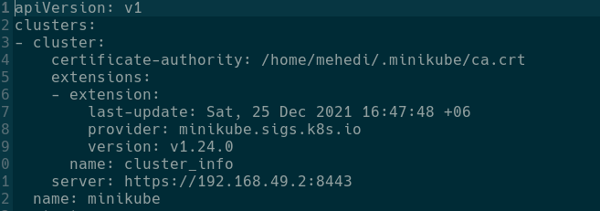
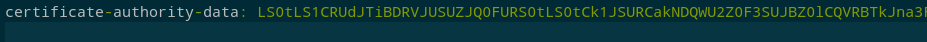
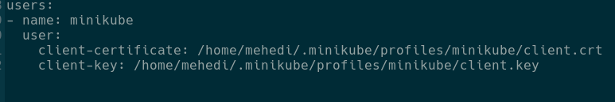
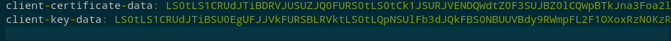

1. install Docker on the system
visit the [link](https://docs.docker.com/get-docker/)
2. install minikube
Download executable from [link to minikube](https://github.com/kubernetes/minikube/releases/)
install minikube using downloaded executable
3. Create minikube cluster with 1 master and 2 worker
```bash
minikube start --nodes 3

kubectl label nodes <worker-node-1-name> disktype=ssd
kubectl label nodes <worker-node-2-name> disktype=hdd
```
4. Install Docker-compose on the system
visit the [link](https://docs.docker.com/compose/install/)

5. clone my jenkins docker-compose repo and run the following command
```bash
git clone https://github.com/mehedi02/jenkins_docker-compose.git
cd jenkins_docker-compose
docker-compose up
```
6. Jenkins installation
    1. visit localhost:8080
    2. For the first time, you need to give admin password.
    3. To find the password look into terminal where you run `docker-compose up`.
    4. Click `install suggested plugins`
    5. In new prompt provide username, password, full name, email
    6. Provide jenkins url. you can keep localhost:8080 or change localhost to ip address of your machine.
    7. Click start using jenkins

7. Install Jenkins plugins
    1. Go to Manage jenkins --> Manage plugins --> available
    2. search Kubernetes, kubernetes for continuous deploy and install these two plugins

8. Add Credentials in Jenkins
    1. Go to Manage Jenkins --> Manage Credentials --> Global --> Add Credentials
    2. For Github, use Username and Password as Kind, add username in username field and Github token value in password field
    3. For Dockerhub, use Secret Text as Kind, and docker-pwd as id and dockerhub token value as secret text
    4. For connecting jenkins to local minikube cluster, we need to upload minikube config file in jenkins
        1. minikube config file is located in .kube folder in home directory.
            a. To navigate to home directory in linux run ```cd ~```

            b. For windows, it is in C:\Users\username

            c. In the home directory, there is **.kube** folder. inside **.kube** folder there is **config** file
        
        2. we need to modify the config file to work with jenkins
            this is our initial file look like:
            
            we need to convert **certificate-authority: /home/mehedi/.minikube/ca.crt**
            a. First run and copy the output
                ```cat /home/mehedi/.minikube/ca.crt | base64 -w 0; echo```
            b. change certificate-authority to **certificate-authority-data** and
                replace **/home/mehedi/.minikube/ca.crt** to output of the above command
                
            c. Under users in name as minikube, change client-certificate and client-key to 
                client-certificate-data and client-key-data.
                our initial file looks like
                

            run the below command and copy the output and add to client-certificate-data and client-key-data
                 ```cat /home/mehedi/.minikube/profiles/minikube/client.crt | base64 -w 0; echo```
                 ```cat /home/mehedi/.minikube/profiles/minikube/client.key | base64 -w 0; echo```
            d. after modifying client-certificate-data and client-key-data look like below
            


    5. From Add Credentials, select Secret File as Kind, add id name (here is mykubeconfig) and upload modified config file
    6. From Add Credentials, select kubernetes configuration (kubeconfig) as kind, add id name (here is mykubernetesconfig) and under **kubeconfig** section select **Enter directly** and copy all the content of modified config file
    7. We need to downgrade kubernetes for continuous deploy to 1.0.0. To do that first go to [jenkins_plugins](https://plugins.jenkins.io/kubernetes-cd/#releases) and download **1.0.0**
    Now go to Manage jenkins --> Manage plugins --> advanced
    in **Deploy Plugin** upload the above downloaded file with .hpi extension

9. Create pipeline
Go to **Dashboard**. Select **pipeline** and give name of pipeline
In the next page, Select **pipeline** and in Definition select **Pipeline script from SCM** in **SCM** section Select Git from drop down menu. In Repository URL give the url of the repository where your code and Jenkinsfile present. In the Credentials, select the github credentials from drop down menu. you can find credentials because we created in the previous steps. if you don't find any github credentials in drop down menu. select Add, you will find Jenkins in drop down and create it with kind username and password as kind.

10. Save the pipeline and run it
After saving the pipeline, you will find **Buid Now** option. click it and the project in the github repo will deploy in minikube cluster


11. get nginx url to access app1 and app2
```bash
minikube service --url nginx
```
it will show the url
Going to base url shows default nginx page
add **/app1** to the above url to access *app1*
add **/app2** to the above url to access *app2*